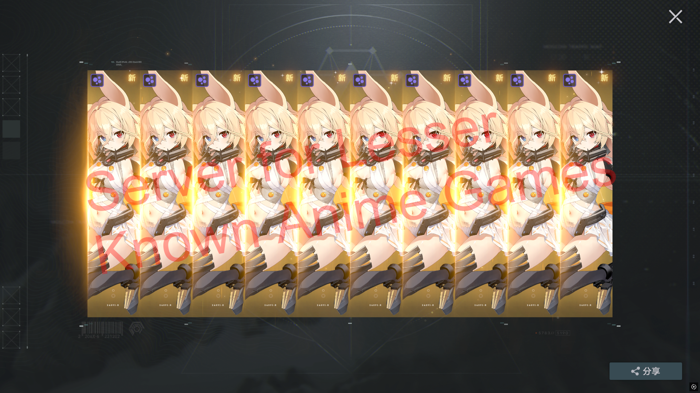

# NTRSimulator

## Server Emulator for a certain NTR game

## Requirements
- .NET 8 SDK
- PostgreSQL
- [daiyan-patcher](https://github.com/raphaeIl/daiyan-patcher/releases)
- CN Game Client is REQUIRED

## Installation Tutorial
1. Clone the repo.
2. Set `ConnectionStrings:Postgres` in `NTRSimulator/appsettings.json` (skip this step if your postgres password is "password")
3. `build`

## Running

1. Start the Server
2. Download the latest [daiyan-patcher](https://github.com/raphaeIl/daiyan-patcher) (`daiyan.dll` + `launcher.exe`) and place them in the game folder (`GF2Exilium\GF2 Game\`)
3. Run `launcher.exe` as administrator

## Common Issues

- If you are unable to compile and getting a lot errors, this is most likely an outdated/broken proto version - right click on solution in vs -> clean solution -> build again
- **中国用户看这里**: 如果无法编译，并且报错提示 NuGet 包不存在，请使用梯子/VPN。本项目使用了自定义 NuGet 包源。

## Optional client patches

Run `Client Patcher.cmd` for an optional English UI or a recruitment archive.
Chinese remains the default, story dialogue stays Chinese, and both patches can
restore the original files. See [setup, coverage, and limitations](client-patcher/README.md).

可选英文界面和历史招募补丁：运行 `Client Patcher.cmd`。默认保留中文，支持恢复原文件，
不翻译剧情对话。详情见 [使用说明](client-patcher/README.md)。

## Features
- [X] Gacha
- [X] All Characters, Weapons, Weapon Mods, Items
- [X] All Character Skins, Weapon Skins, Weapon Mod Skins
- [X] Command System 
    - `/inventory addall`
    - `/help`
- [X] Regular Dorm
- [X] Skin Gacha
- [X] Partial 3D Dorm Support

## TODO
- [ ] Full 3D Dorm Support
- [ ] Dorm Affinity System 
- [ ] Story
- [ ] Built-in GM

## Support & Discuss
[Discord Server](https://discord.gg/ZCWrqH9f9H)

## Special Thanks
- [rafi1212122](https://github.com/rafi1212122) - Inspired by rfi's previous ps, and also helping me with core logic
- [wazuin](https://github.com/wazuin) - Sponsor
