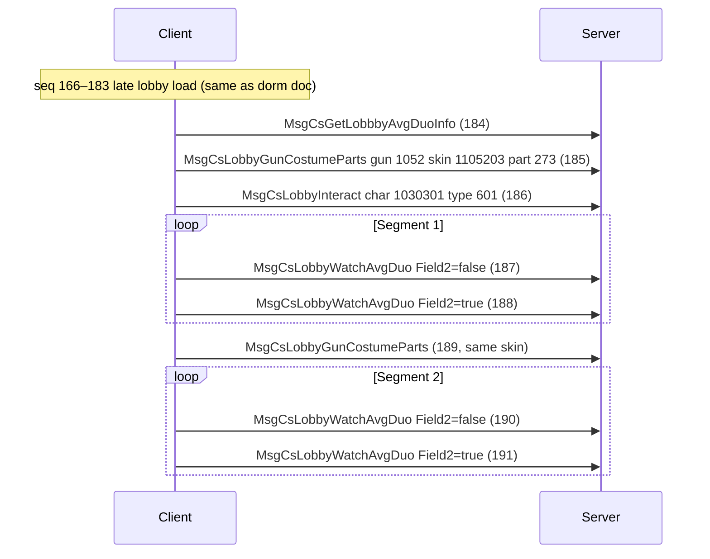

# Instant Dorm Lobby Packet Order

This note tracks the official 3D dorm / dorm lobby capture. The capture path was: login, reach the normal lobby, immediately enter the 3D dorm lobby, land there, then close the game.

Sources:

- `client_log_instant_dorm_lobby.log`
- `NTRSimulator.PcapParser/bin/Debug/net8.0/Resources/Packets/instant_dorm_lobby.json`
- `NTRSimulator.PcapParser/bin/Debug/net8.0/Resources/Packets/instant_lobby_char_special_event.json` (lobby char skin special AVG duo event; see below)
- `NTRSimulator.PcapParser/bin/Debug/net8.0/Resources/full_features.json` (cross-reference for `MsgCsLobbyWatchAvgDuo` story-id bodies)
- `NTRSimulator.Common/Protocol/MsgId.cs`

## High-Level Shape

The parsed JSON contains 513 decoded packets: 182 client requests followed by 331 server responses. The Frida log does not include decoded packet names, but it does include raw `Client->server socket send bytes` blocks. Decoding those blocks confirms the client sends large startup request bursts, then a smaller dorm/lobby loading sequence.

Important caveat: the JSON is best for decoded packet bodies and response bundle contents. The Frida log is best for request burst timing. The log capture has no decoded `Dorm` or `Lobby` strings, so dorm correlation comes from the decoded packet names and the point where the request stream changes to dorm/lobby-specific messages.

## Request Burst Order From Log

```text
01. line 56, 325 bytes
    Seq 1: MsgCsLogin

02. line 200, 9 bytes
    Seq 2: MsgCsGetPrefaceRecord

03. line 206, 38 bytes
    Seq 3: msg id 1201, not decoded in instant_dorm_lobby.json

04. line 232, 22 bytes
    Seq 4-5: MsgCsStageRecord

05. line 282, 9 bytes
    Seq 6: MsgCsMomentFetch

06. line 364, 432 bytes
    Seq 7-52: startup account/player/lobby data burst
    First: MsgCsClientDataGet, MsgCsTimers, MsgCsAdjutantInfo
    Last: MsgCsPlan, MsgCsPlan, MsgCsGetGachaCumulativeInfo, MsgCsRecordRoom

07. line 3993, 621 bytes
    Seq 53-119: second startup/lobby burst
    Includes friends, mails, initial lobby mini-game/cafe/cooking/buff/quest/tutorial,
    support room, control room, activity/shop, lobby event/build/scheme/party data.

08. line 5425, 207 bytes
    Seq 120-140: immediate pre-dorm/dorm burst
    Includes assistant/activity/dark-zone, then:
      Seq 127: MsgCsDormInfo
      Seq 128: MsgCsGetDormFormationInfo
      Seq 129: MsgCsGetCharacterDailyInfo
      Seq 134-136: support room/team/chat friend list
      Seq 140: MsgCsGunWeaponSkinItems

09. line 5431, 69 bytes
    Seq 141-147: stage/activity/message-board follow-up

10. line 5753, 63 bytes
    Seq 148-152: sim cafe warm-up and rouge map/game follow-up

11. line 5931, 121 bytes
    Seq 153-163: many MsgCsStageRecord requests

12. line 6091, 9 bytes
    Seq 164: MsgCsGunWeaponModGetContinuouslyPolarization

13. line 6117, 18 bytes
    Seq 165: MsgCsTreasureData
    Seq 166: MsgCsLobbyGetBuildInfo

14. line 6151, 9 bytes
    Seq 167: MsgCsLobbyMessageBoardInfo

15. line 6177, 13 bytes
    Seq 168: MsgCsClientReachCount, Field1 = 1, Field2 = 4

16. line 6203, 9 bytes
    Seq 169: MsgCsLobbyPartyInfo

17. line 6241, 128 bytes
    Seq 170-183: final 3D lobby state burst
    MsgCsLobbyGetSchemeV2, CookingInfo, BuffInfo, PlantInfo, AvatarInfo,
    GunSetting, CafeInfo, ControlRoomScheme, LobbyCharacterInfo, MeilingConfig,
    MessageBoardInfo, PhotoCut, WelcomeSettingInfo, BirthdayCareInfo.
```

## Dorm-Relevant Packet Order

The transition into 3D dorm starts at `MsgCsDormInfo` seq 127. Some packets immediately before it are probably global lobby/startup dependencies, not dorm-only packets, but they may still need handlers because the client asks for them before it considers lobby loading complete.

```text
Pre-dorm lobby/state requests:

102. CS 29004 MsgCsLobbyGetEventInfo
     SC 29005 MsgScLobbyGetEventInfo

104. CS 29015 MsgCsLobbyGetBuildInfo
     SC bundle for SeqId 104, MainMessageId 361:
     indexes 0-13: MsgScPlayerStatusCounterSync
     index 14: MsgScLobbyGetBuildInfo

105. CS 29158 MsgCsLobbyGetSchemeV2
     SC 29159 MsgScLobbyGetSchemeV2

106. CS 29504 MsgCsLobbyCookingInfo
     SC 29505 MsgScLobbyCookingInfo

107. CS 29102 MsgCsLobbyBuffInfo
     SC 29103 MsgScLobbyBuffInfo

108. CS 29109 MsgCsLobbyAsmrInfo
     SC 29110 MsgScLobbyAsmrInfo

109. CS 29024 MsgCsLobbyGetQuestInfo
     SC 29025 MsgScLobbyGetQuestInfo

110. CS 29150 MsgCsLobbyTutorialInfo
     SC 29151 MsgScLobbyTutorialInfo

111. CS 23156 MsgCsOutfitCollectionInfo
     SC 23157 MsgScOutfitCollectionInfo

112. CS 29300 MsgCsLobbyPartyInfo
     SC 29301 MsgScLobbyPartyInfo

113. CS 22035 MsgCsGetAllOldScheme
     SC 22036 MsgScGetAllOldScheme

114. CS 29402 MsgCsGetLobbyShareCodeIdx
     SC 29403 MsgScGetLobbyShareCodeIdx

115. CS 24014 MsgCsDarkZoneGetEthnicInfo
     SC 24015 MsgScDarkZoneGetEthnicInfo

116. CS 29282 MsgCsLobbyBirthdayCareInfo
     SC 29283 MsgScLobbyBirthdayCareInfo

117. CS 11096 MsgCsGunWeaponSkinItems
     SC 11097 MsgScGunWeaponSkinItems

118. CS 12300 MsgCsGetBattlepassInfo
     SC 12301 MsgScGetBattlepassInfo

119. CS 21912 MsgCsGuildApplyList
     SC 21913 MsgScGuildApplyList

120-126. CS/SC assistant, plan activity, dark-zone storage/quest/wish data
     These are not dorm-specific, but they happen directly before dorm info.

Dorm entry:

127. CS 11626 MsgCsDormInfo
     SC 11627 MsgScDormInfo
     Payload shape:
       Field1.Field3 has 10 gun/doll entries keyed by id.
       Field1.Field9 = 1032.
       Field2 maps five skin ids to value 273:
         1104201, 1103901, 1104801, 1105203, 1105401.

128. CS 10931 MsgCsGetDormFormationInfo
     SC 10932 MsgScGetDormFormationInfo
     Payload: Field1 is empty map.

129. CS 10929 MsgCsGetCharacterDailyInfo
     SC 10930 MsgScGetCharacterDailyInfo
     Payload: Field1 is empty map.

130-132. CS guild info/supply/member list
     Responses are delayed until after seq 140 in the decoded stream.

133. CS 22061 MsgCsSupportChip
     No matching response packet appears in the parsed JSON for seq 133.

134. CS 22043 MsgCsSupportRoomInfo
     SC 22044 MsgScSupportRoomInfo

135. CS 22057 MsgCsSupportTeams
     SC 22058 MsgScSupportTeams

136. CS 11708 MsgCsChatFriendList
     SC 11709 MsgScChatFriendList

137-139. CS/SC rouge info, rouge info, rouge season info

140. CS 11096 MsgCsGunWeaponSkinItems
     SC 11097 MsgScGunWeaponSkinItems
```

## Late 3D Lobby Load

After the dorm info phase, the client requests a lot of stage/activity side data, then reloads the actual 3D lobby state. This appears to be the most important section for making the dorm lobby render after entry.

```text
141. CS 10320 MsgCsStageRecord, Field2 = 36
     SC 10321 MsgScStageRecord, Field2 has 170 entries

142. CS 10320 MsgCsStageRecord, Field2 = 33
     SC 10321 MsgScStageRecord, Field2 has 39 entries

143. CS 12564 MsgCsTreasureData
     SC 12565 MsgScTreasureData

144. CS 12518 MsgCsActivityGetMedium
     SC 12519 MsgScActivityGetMedium

145. CS 29189 MsgCsLobbyMessageBoardInfo
     SC 29190 MsgScLobbyMessageBoardInfo

146. CS 12147 MsgCsDarkZoneGetUnlockEggStage
     SC 12148 MsgScDarkZoneGetUnlockEggStage

147. CS 10320 MsgCsStageRecord, Field2 = 63
     SC 10321 MsgScStageRecord, empty Field2

148-149. CS 12467 MsgCsGetSimCafeWarmUpInfo, Field1 = 3701
     SC 12468 MsgScGetSimCafeWarmUpInfo

150. CS 23105 MsgCsGetRougeMapInfo, Field1 = 600002
     SC 23106 MsgScGetRougeMapInfo

151. CS 23105 MsgCsGetRougeMapInfo, Field1 = 600003
     SC 23106 MsgScGetRougeMapInfo

152. CS 24102 MsgCsRougeGameInfo, Field1 = 600004
     SC 24103 MsgScRougeGameInfo

153-163. CS 10320 MsgCsStageRecord
     Field2 values in order:
       54, 13, 26, 20, 21, 31, 41, 22, 64, 52, 63
     Responses are MsgScStageRecord with sizes ranging from empty to 65 entries.

164. CS 12700 MsgCsGunWeaponModGetContinuouslyPolarization
     SC 12701 MsgScGunWeaponModGetContinuouslyPolarization

165. CS 12564 MsgCsTreasureData
     SC 12565 MsgScTreasureData

166. CS 29015 MsgCsLobbyGetBuildInfo
     SC bundle for SeqId 166, MainMessageId 422:
       indexes 0-13: alternating MsgScPlayerStatusCounterSync groups
       index 14: MsgScLobbyGetBuildInfo
     The build info payload lists unlocked build groups:
       101 -> 15 ids
       102 -> 9 ids
       103 -> 3 ids
       104 -> 2 ids
       201 -> empty
       202 -> 2 ids
       106 -> empty
     Field2 = 49, Field3 contains 2 through 49, Field4 = 39600.

167. CS 29189 MsgCsLobbyMessageBoardInfo
     SC 29190 MsgScLobbyMessageBoardInfo

168. CS 10467 MsgCsClientReachCount
     Request fields: Field1 = 1, Field2 = 4
     SC 10468 MsgScClientReachCount, Field1 = 0, Field2 = 4

169. CS 29300 MsgCsLobbyPartyInfo
     SC 29301 MsgScLobbyPartyInfo
     Payload contains party groups 101, 102, and 103 with unlocked slots.

170. CS 29158 MsgCsLobbyGetSchemeV2
     SC 29159 MsgScLobbyGetSchemeV2
     Payload contains active scheme data for groups 101 and 102 plus four empty scheme slots.

171. CS 29504 MsgCsLobbyCookingInfo
     SC 29505 MsgScLobbyCookingInfo

172. CS 29102 MsgCsLobbyBuffInfo
     SC 29103 MsgScLobbyBuffInfo
     Payload has a large gun/doll id -> buff/level map and a 10-entry Field3 map.

173. CS 29444 MsgCsLobbyPlantInfo
     SC 29445 MsgScLobbyPlantInfo
     Payload is an empty/default plant state object.

174. CS 29185 MsgCsLobbyAvatarInfo
     SC 29186 MsgScLobbyAvatarInfo
     Payload: Field1.Field1 = 1071, Field1.Field2 = 1002.

175. CS 29162 MsgCsLobbyGetGunSetting
     SC 29163 MsgScLobbyGetGunSetting
     Payload has 28 gun setting entries. Each entry includes gun id, skin id, and small state fields.

176. CS 29125 MsgCsLobbyGetCafeInfo
     SC 29126 MsgScLobbyGetCafeInfo
     Payload has Field2 = 5, seven Field3 entries, six Field4 entries, and empty Field5/Field6 lists.

177. CS 21999 MsgCsControlRoomScheme
     SC 21998 MsgScControlRoomScheme
     Payload includes scheme id lists, Field3 = 1335002, Field4 = 1335101.

178. CS 29115 MsgCsLobbyCharacterInfo
     SC 29116 MsgScLobbyCharacterInfo
     Payload contains 10 enabled lobby character ids and an empty Field2 list.

179. CS 29181 MsgCsGetLobbyMeilingConfig
     SC 29182 MsgScGetLobbyMeilingConfig
     Payload Field1 = [402, 403, 404, 405].

180. CS 29189 MsgCsLobbyMessageBoardInfo
     SC 29190 MsgScLobbyMessageBoardInfo

181. CS 29144 MsgCsGetLobbyPhotoCut, Field1 = 1
     SC 29145 MsgScGetLobbyPhotoCut
     Payload has 74 unlocked photo cut ids and Field3 = 1.

182. CS 29196 MsgCsLobbyWelcomeSettingInfo
     SC 29197 MsgScLobbyWelcomeSettingInfo
     Payload: enabled true, timestamp 1782025827, selected id 1017, Field5 true.

183. CS 29282 MsgCsLobbyBirthdayCareInfo
     SC 29283 MsgScLobbyBirthdayCareInfo
     Payload: Field1 = 1780934400, Field2 = false.
```

## Implementation Notes

For a private-server dorm lobby path, the most important handlers appear to be:

```text
Required for dorm entry:
  MsgCsDormInfo -> MsgScDormInfo
  MsgCsGetDormFormationInfo -> MsgScGetDormFormationInfo
  MsgCsGetCharacterDailyInfo -> MsgScGetCharacterDailyInfo

Required for 3D lobby render/state after entry:
  MsgCsLobbyGetBuildInfo -> bundle with counter syncs + MsgScLobbyGetBuildInfo
  MsgCsLobbyPartyInfo -> MsgScLobbyPartyInfo
  MsgCsLobbyGetSchemeV2 -> MsgScLobbyGetSchemeV2
  MsgCsLobbyBuffInfo -> MsgScLobbyBuffInfo
  MsgCsLobbyPlantInfo -> MsgScLobbyPlantInfo
  MsgCsLobbyAvatarInfo -> MsgScLobbyAvatarInfo
  MsgCsLobbyGetGunSetting -> MsgScLobbyGetGunSetting
  MsgCsLobbyGetCafeInfo -> MsgScLobbyGetCafeInfo
  MsgCsControlRoomScheme -> MsgScControlRoomScheme
  MsgCsLobbyCharacterInfo -> MsgScLobbyCharacterInfo
  MsgCsGetLobbyMeilingConfig -> MsgScGetLobbyMeilingConfig
  MsgCsGetLobbyPhotoCut -> MsgScGetLobbyPhotoCut
  MsgCsLobbyWelcomeSettingInfo -> MsgScLobbyWelcomeSettingInfo
  MsgCsLobbyBirthdayCareInfo -> MsgScLobbyBirthdayCareInfo

Likely needed as harmless/default support data:
  MsgCsLobbyMessageBoardInfo -> MsgScLobbyMessageBoardInfo
  MsgCsLobbyCookingInfo -> MsgScLobbyCookingInfo
  MsgCsClientReachCount -> MsgScClientReachCount
  MsgCsSupportRoomInfo -> MsgScSupportRoomInfo
  MsgCsSupportTeams -> MsgScSupportTeams
  MsgCsChatFriendList -> MsgScChatFriendList
  MsgCsGunWeaponSkinItems -> MsgScGunWeaponSkinItems
```

`MsgScLobbyGetBuildInfo` is bundled with 14 `MsgScPlayerStatusCounterSync` packets both before dorm entry seq 104 and during the late 3D lobby load seq 166. If the client is sensitive to official framing, preserve that bundle shape instead of sending `MsgScLobbyGetBuildInfo` alone.

The capture does not include interactions inside the dorm after landing. It only proves the data needed to enter and settle in the 3D dorm lobby. Furniture placement, visits, dorm character interaction, and dorm-room actions would need separate captures.

## Lobby Character Skin Special Event (WatchAvgDuo)

Separate capture for: login, reach lobby, immediately trigger a **character skin special cutscene** (AVG duo) tied to a pulled lobby costume.

Source: `NTRSimulator.PcapParser/bin/Debug/net8.0/Resources/Packets/instant_lobby_char_special_event.json`

Cross-reference: `full_features.json` seq 311–316 shows the same interact type with populated `MsgCsLobbyWatchAvgDuo` story-id lists.

### Capture Shape

The JSON has 199 decoded packets: 190 sequenced client requests and only 8 server responses (a late login bundle at the end of the file). **Request order is reliable; SC bodies for this event are mostly missing from the parse.** Where noted below, response shapes come from proto definitions, existing handlers, or `full_features.json` for the one message type that does appear (`MsgScLobbyGunCostumeParts`).

Login carries `Field11 = "1093303"` (selected lobby costume hint on connect).

### High-Level Flow

```text
Login + startup bursts (seq 1–166)
  Same broad shape as instant_dorm_lobby: account sync, dorm entry, stage-record side loads.

Late 3D lobby reload (seq 166–183)
  Same terminal lobby-state burst as instant_dorm_lobby seq 166–183
  (build info bundle, message board, reach count, party, scheme, cooking, buff, plant,
   avatar, gun setting, cafe, control room, character info, meiling, message board,
   photo cut, welcome, birthday care).

AVG duo prefetch + costume prep (seq 184–185)
  MsgCsGetLobbbyAvgDuoInfo
  MsgCsLobbyGunCostumeParts

Trigger special interact (seq 186)
  MsgCsLobbyInteract, Field2 = 601

WatchAvgDuo segment loop ×2 (seq 187–191)
  begin/end pair, costume re-sync, begin/end pair again
```



### Event Packet Order (instant_lobby_char_special_event.json)

Prerequisite: seq 166–183 match the **Late 3D Lobby Load** section above (from `MsgCsLobbyGetBuildInfo` through `MsgCsLobbyBirthdayCareInfo`). The event starts immediately after that burst.

```text
184. CS 29169 MsgCsGetLobbbyAvgDuoInfo
     Request: empty body.
     Expected SC 29170 MsgScGetLobbbyAvgDuoInfo
       Field1: map<uint, bool> watched/unlocked duo segment ids
       Field2: map<uint, bool> second progress map
     No SC appears in this capture or full_features.json; private server currently acks empty maps.

185. CS 29138 MsgCsLobbyGunCostumeParts
     Request: Field1 = 1052, Field2 = 1105203, Field3 = 273
       gun id 1052, costume/skin id 1105203, costume part id 273
     SC 29139 MsgScLobbyGunCostumeParts
       empty body in full_features.json (seq 241)

186. CS 29030 MsgCsLobbyInteract
     Request: Field1 = 1030301, Field2 = 601, Field3 = 0
       Field1: lobby character key (10303 + 01 pattern)
       Field2: 601 = special skin AVG duo / char event interact type
       Field3: sub-target / slot (0 here)
     Expected SC 29031 MsgScLobbyInteract
       echoes Field1, Field2 = true, Field3 from request
     No SC in parsed captures; handler mirrors request fields.

187. CS 29171 MsgCsLobbyWatchAvgDuo
     Request: Field1 = [], Field2 = false
     Begin-watch ping for segment 1 (client omits story ids in this capture).

188. CS 29171 MsgCsLobbyWatchAvgDuo
     Request: Field1 = [], Field2 = true
     End-watch ping for segment 1.

189. CS 29138 MsgCsLobbyGunCostumeParts
     Same request as seq 185 (re-apply costume between duo segments).

190. CS 29171 MsgCsLobbyWatchAvgDuo
     Request: Field1 = [], Field2 = false
     Begin-watch ping for segment 2.

191. CS 29171 MsgCsLobbyWatchAvgDuo
     Request: Field1 = [], Field2 = true
     End-watch ping for segment 2; capture ends here.
```

### WatchAvgDuo Request Pattern (full_features.json)

When the client sends explicit story ids (same interact 601 flow, seq 311 in `full_features.json`), each segment uses a **false/true pair**:

| Step | Field2 | Field1 (story segment ids) |
|------|--------|----------------------------|
| Begin segment | `false` | `[105204011, 105204013, 105204015]` |
| End segment | `true` | `[1052040111, 1052040133, 1052040151]` |

Ids look like gun `1052` + `04` + chapter suffix; completion ids append a trailing `1` (or otherwise derive from the begin id). The special-event capture sends **empty `Field1`** for all four WatchAvgDuo calls — the server is probably expected to infer active duo lines from the prior `LobbyInteract` 601 + costume context.

`full_features.json` runs **two** false/true cycles (seq 312–313, then 315–316) with `MsgCsLobbyGunCostumeParts` between them (seq 314), matching the two-loop shape in the special-event capture.

Proto shapes:

```text
CS_LobbyWatchAvgDuo / SC_LobbyWatchAvgDuo
  Field1: repeated uint (story segment ids)
  Field2: bool (false = begin/progress, true = finish/complete)

CS_LobbyInteract / SC_LobbyInteract
  Field1: uint (lobby character id)
  Field2: uint (interact type; 601 = skin special AVG duo event)
  Field3: uint

CS_LobbyGunCostumeParts / SC_LobbyGunCostumeParts
  Field1: gun id
  Field2: costume/skin id
  Field3: costume part id

CS_GetLobbbyAvgDuoInfo / SC_GetLobbbyAvgDuoInfo
  CS: empty
  SC: Field1 map<uint,bool>, Field2 map<uint,bool>
```

### Implementation Notes (WatchAvgDuo path)

Handlers involved:

```text
MsgCsGetLobbbyAvgDuoInfo -> MsgScGetLobbbyAvgDuoInfo
  AvgDuoHandler; empty maps until a capture with SC body exists.

MsgCsLobbyGunCostumeParts -> MsgScLobbyGunCostumeParts
  LobbyHandler; empty SC ack (matches full_features).

MsgCsLobbyInteract (Field2 = 601) -> MsgScLobbyInteract
  LobbyHandler; echo Field1, Field2 = true, Field3.

MsgCsLobbyWatchAvgDuo -> MsgScLobbyWatchAvgDuo
  LobbyHandler; not implemented yet — no SC sample in any parsed JSON.
  Implement as ack mirroring CS Field1/Field2 once a response capture exists.
```

Minimum path to reach the event after lobby load: handlers for seq 166–183 (Late 3D Lobby Load), then the five message types above. Costume part `273` and skin `1105203` on gun `1052` are the values used in both this capture and the matching `full_features.json` GunCostumeParts calls.
